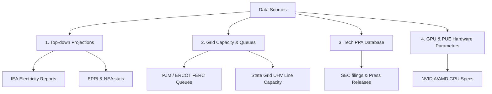
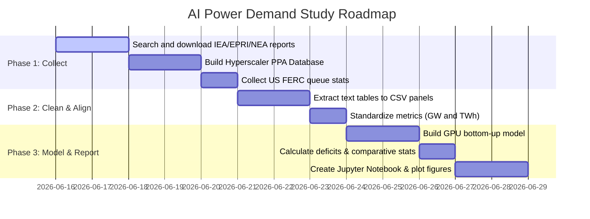

# Research Plan: AI Power Demand & Grid Deficit (US vs. China)

This plan details the data collection, cleaning, modeling, and analysis steps to compare AI-driven datacenter electricity demand against grid capacity and clean energy fulfillment in the US and China through 2030.

## 1. Goal & Scope
To quantify the projected power demand of AI datacenters in the US and China, identify grid bottlenecks, calculate deficits, and evaluate the contribution of off-grid/dedicated solutions (such as nuclear PPAs in the US).

## 2. Core Quantitative Model

### A. AI Datacenter Demand Projections
We will build a bottom-up estimation model based on hardware deployments:
$$\text{Datacenter Power Demand (GW)} = \sum \big(N_{\text{GPUs}} \times W_{\text{GPU}}\big) \times \text{PUE}$$
Where:
*   $N_{\text{GPUs}}$: Estimated active GPU footprint (cumulative shipments from Nvidia, AMD, and custom chips).
*   $W_{\text{GPU}}$: Thermal Design Power (TDP) per GPU (e.g., 0.7 kW for H100, 1.2 kW for Blackwell B200).
*   $\text{PUE}$: Average Power Usage Effectiveness of AI datacenters (typically 1.15 to 1.3).

We will validate this bottom-up model against top-down projections from the International Energy Agency (IEA), Electric Power Research Institute (EPRI), and major consulting studies.

### B. Grid Deficit & Bottleneck Model
$$\text{Deficit (GW)} = \text{Projected AI Load} - \text{Available Grid Capacity} - \text{Dedicated Clean Energy PPAs}$$
*   **United States:** Available grid capacity will be constrained by the **Interconnection Queue Release Rate** (based on PJM, ERCOT, MISO historical rates) and regulatory wait times.
*   **China:** Available grid capacity will be constrained by the **East-West Transmission Capacity** (UHV line capacity moving electricity from western wind/solar bases to eastern computation centers).

---

## 3. Data Collection Strategy

We will collect data across four primary channels:

### A. Top-down Projections
*   **US/Global:** Download data from the **IEA Electricity 2024 Report** (contains explicit datacenter power projections through 2026/2030) and EPRI.
*   **China:** Download statistics from the **China National Energy Administration (NEA)** and **State Grid Corporation of China (SGCC)**.

### B. Grid Interconnection & Transmission queues
*   **US:** Scrape or download queue capacity and average wait time statistics from PJM, ERCOT, and Lawrence Berkeley National Laboratory (LBNL) "Queued Up" database.
*   **China:** Collect capacity and project timelines for the **"East-West Data Center Computing" (东数西算)** project and UHV line capacities from SGCC reports.

### C. Hyperscaler PPA Database (Dedicated capacity)
Build a structured database of Big Tech clean energy contracts (nuclear, geothermal, utility solar/wind) containing:
*   `hyperscaler`: MSFT, AMZN, GOOGL, META
*   `energy_source`: Nuclear, Geothermal, Solar, Wind, etc.
*   `capacity_mw`: Contract capacity in Megawatts.
*   `status`: Operational, Planned (operational date).
*   `cik` & `source`: Audit link to press release or SEC filing.

---

## 4. Implementation Roadmap

### Action Items
1.  **Create project skeleton:** Create the folders `data/raw`, `data/processed`, `scripts`, `output/tables`, `output/figures`.
2.  **Implement scripts/config.py:** Define parameters (average GPU power consumption, PUE values, CIKs).
3.  **Implement scripts/01_collect.py:** Scrape/fetch queue data, PPA database, and industry reports.
4.  **Implement scripts/02_clean.py:** Standardize units and period alignment.
5.  **Implement scripts/03_analyze.py:** Calculate bottom-up demand and net grid deficits.
6.  **Create output/report.en.ipynb:** Generate the comparative report and deficit curves.

