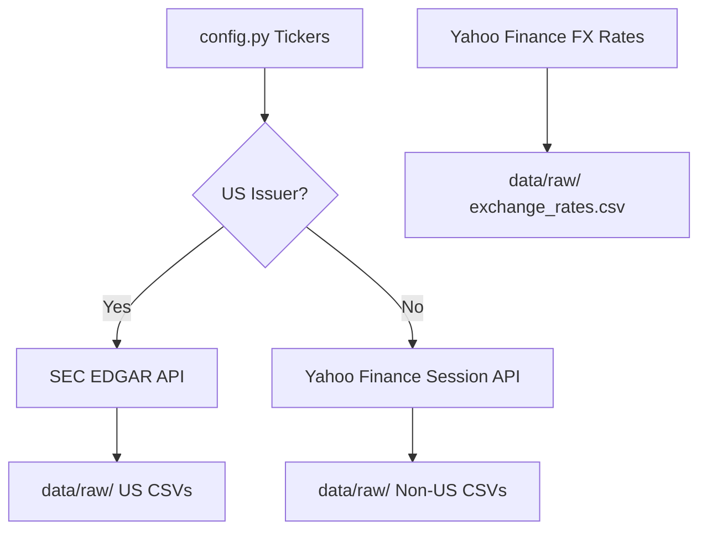
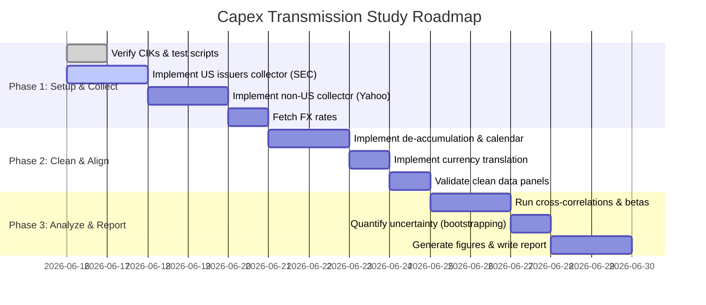

# Research Plan: Tech Capex → Semiconductor Transmission Chain

This research plan outlines the methodology, data engineering pipeline, and statistical analysis required to investigate how the capital expenditure of major technology hyperscalers propagates down the semiconductor supply chain.

## 1. Goal & Hypotheses

### Primary Question
When hyperscaler capex accelerates, does each downstream layer of the chip supply chain show a measurable, *lagged* acceleration in revenue/earnings — and can we estimate the lead time (in quarters) and strength of transmission at each layer?

### Hypotheses to Test
*   **H1 (transmission exists):** YoY hyperscaler capex growth is positively correlated with each downstream layer's YoY revenue growth.
*   **H2 (lead-lag ordering):** The driver leads each downstream layer. The lead time is shortest for accelerators/foundry and longest for equipment and materials:
    $$\text{Capex (driver)} \rightarrow \text{Accelerators} \rightarrow \text{Foundry} \rightarrow \text{Equipment} \rightarrow \text{Materials}$$
*   **H3 (amplification/attenuation):** Transmission strength differs by layer; some layers amplify the signal (higher growth beta) and some attenuate it.
*   **H4 (winners):** An identifiable subset of companies shows revenue/earnings growth most tightly coupled to the capex cycle.

---

## 2. Supply Chain Definition (Scope)

The transmission chain is defined in [config.py](file:///Users/yaogu/Developer/analysis/research/capex_chip_transmission/scripts/config.py) across 5 layers:

| Layer | Role | Tickers | Expected Lag (Quarters) | Metrics Measured |
| --- | --- | --- | :---: | --- |
| **0. Hyperscaler Capex (Driver)** | Datacenter & AI buildout | `MSFT`, `GOOGL`, `AMZN`, `META` | 0 | Capital Expenditure (Capex) |
| **1. Accelerators & Designers** | Chip designers & networking | `NVDA`, `AMD`, `AVGO`, `MRVL` | 1 | Revenue, Operating Income |
| **2. Foundry** | Wafer manufacturing | `TSM` | 2 | Revenue, Net Income (Proxy for OpInc) |
| **3. Equipment** | Manufacturing equipment | `ASML`, `AMAT`, `LRCX`, `KLAC`, `8035.T` (TEL) | 3 | Revenue, Operating/Net Income |
| **4. Materials & Substrates** | Wafers, chemicals, substrates | `SHECY` (Shin-Etsu), `3436.T` (SUMCO), `ENTG` | 4 | Revenue, Operating/Net Income |

---

## 3. Data Collection Strategy

To ensure zero fabrication and full auditability, data must be sourced from primary disclosures. We split collection into two channels:

### A. US Issuers (SEC EDGAR API)
*   **Endpoint:** `https://data.sec.gov/api/xbrl/companyfacts/CIK{cik_padded}.json`
*   **Authentication:** Requires a custom User-Agent header: `User-Agent: MyResearchProject/1.0 (yaogu@analysis.com)`.
*   **CIK Mapping:**
    *   `MSFT`: `0000789019` | `GOOGL`: `0001652044` | `AMZN`: `0001018724` | `META`: `0001326801`
    *   `NVDA`: `0001045810` | `AMD`: `0000002488` | `AVGO`: `0001730168` | `MRVL`: `0001037949`
    *   `AMAT`: `0000006951` | `LRCX`: `0000707549` | `KLAC`: `0000319201` | `ENTG`: `0001103982`
*   **Tag Prioritization:**
    *   **Revenue:** `RevenueFromContractWithCustomerExcludingAssessedTax` $\rightarrow$ `SalesRevenueNet` $\rightarrow$ `Revenues`
    *   **Operating Income:** `OperatingIncomeLoss`
    *   **Capex:** `PaymentsToAcquirePropertyPlantAndEquipment`

### B. Non-US Issuers (Yahoo Finance Session & Crumb Bypass)
Because foreign private issuers do not report structured XBRL quarterly to SEC EDGAR, we fetch quarterly income statements from Yahoo Finance:
*   **Bypass Technique:** First query `https://finance.yahoo.com` in a requests `Session` to retrieve valid session cookies (`A1`, `A3`), then query `https://query2.finance.yahoo.com/v1/test/getcrumb` to acquire a session crumb, and finally query `quoteSummary` with the crumb:
    `https://query2.finance.yahoo.com/v10/finance/quoteSummary/{ticker}?modules=incomeStatementHistoryQuarterly&crumb={crumb}`
*   **Tickers mapped:** `TSM`, `ASML`, `8035.T`, `SHECY` (Shin-Etsu ADR), `3436.T`.
*   **Metrics:** `totalRevenue` and `netIncome` (used as proxy for operating income due to incomplete secondary items on foreign tickers).

### C. Exchange Rates (Yahoo Finance Chart API)
*   **Endpoint:** `https://query1.finance.yahoo.com/v8/finance/chart/{currency_pair}?interval=1d&range=5y`
*   **Pairs:** `TWD=X` (USD/TWD), `EURUSD=X` (EUR/USD), `JPY=X` (USD/JPY).
*   **Method:** Retrieve daily closing rates and compute quarterly averages for translating financial metrics to USD.

---

## 4. Data Cleaning & Alignment (scripts/02_clean.py)

1.  **De-accumulation (YTD to Discrete Quarters):**
    For SEC cash flow items like Capex (`PaymentsToAcquirePropertyPlantAndEquipment`), values are reported cumulatively. We must transform them:
    $$\text{Capex}_{Q\_discrete} = \begin{cases} 
      \text{Capex}_{Q\_cumulative} & \text{if } Q=Q1 \\
      \text{Capex}_{Q\_cumulative} - \text{Capex}_{Q-1\_cumulative} & \text{if } Q > Q1 
    \end{cases}$$
2.  **Currency Translation:**
    Convert non-USD revenues/earnings:
    *   **TSMC (TWD):** Divide by average USD/TWD rate.
    *   **ASML (EUR):** Multiply by average EUR/USD rate.
    *   **TEL / SUMCO / Shin-Etsu (JPY):** Divide by average USD/JPY rate.
3.  **Calendar Quarter Alignment:**
    Align fiscal period end dates to calendar quarter ends (`YYYY-03-31` for Q1, etc.) using `pd.PeriodIndex(..., freq='Q')` to ensure contemporaneous comparisons.

---

## 5. Statistical Analysis Methodology (scripts/03_analyze.py)

1.  **Growth Metrics:** Compute YoY fractional growth rates for each company and layer:
    $$\text{YoY Growth}_t = \frac{X_t - X_{t-4}}{X_{t-4}}$$
2.  **Lead-Lag Cross-Correlation:**
    For each downstream layer $L$, calculate the Pearson correlation between aggregate driver capex growth at time $t$ and layer revenue growth at time $t + \text{lag}$ for $\text{lag} \in [-8, 8]$ quarters:
    $$\rho_L(k) = \text{Corr}\big(G_{\text{driver}}(t), G_L(t + k)\big)$$
    Identify the peak correlation and the corresponding lag ($k^*$):
    $$k^*_L = \arg\max_k |\rho_L(k)|$$
3.  **Growth Beta (Transmission Strength):**
    Regress layer growth on lagged driver capex growth:
    $$G_L(t) = \alpha + \beta_L \cdot G_{\text{driver}}(t - k^*_L) + \epsilon_t$$
    The coefficient $\beta_L$ represents the transmission multiplier (growth beta).
4.  **Uncertainty Quantification:**
    Use percentile bootstrap resampling ($N = 10,000$ iterations) via `utils.stats.bootstrap_ci` to calculate 95% confidence intervals for $\rho_L(k^*)$ and $\beta_L$.

---

## 6. Implementation Roadmap

### Action Items
1.  **Modify `scripts/01_collect.py`:**
    *   Incorporate CIK lookup for US issuers.
    *   Write the SEC EDGAR scraper.
    *   Write the Yahoo Finance scraper using the session cookie & crumb bypass technique.
    *   Write the FX rate downloader.
2.  **Modify `scripts/02_clean.py`:**
    *   Incorporate cash-flow de-accumulation logic.
    *   Incorporate foreign exchange currency conversion logic.
3.  **Modify `scripts/03_analyze.py`:**
    *   Implement regression beta analysis.
    *   Incorporate confidence interval estimation using bootstrapping.
4.  **Create final Jupyter Notebook report (`output/report.en.ipynb`):**
    *   Visualize indexed growth curves.
    *   Plot lead-lag cross-correlation profiles.
    *   Tabulate peak lags, correlations, and growth betas with 95% CIs.
